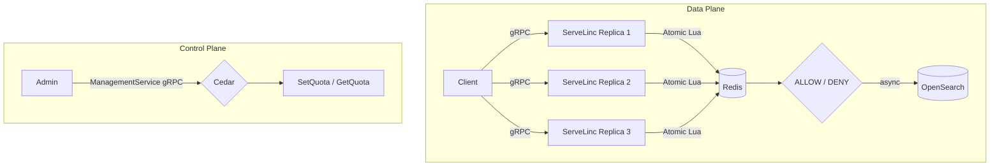

# ServeLinc

Distributed global quota enforcement for horizontally scaled, multi-tenant APIs.

## Overview

ServeLinc is a gRPC service that enforces a single shared quota across multiple application replicas. It uses Redis as shared state and a Lua script for atomic quota evaluation. When a request arrives at any replica, the quota decision is computed against the same shared counter, not a per-replica local one.

The project also includes Cedar-based authorization for management operations, OpenSearch for asynchronous telemetry, and a real distributed integration test that exercises node failure.

## Problem

A quota of 100 requests/minute means 100 globally, not 100 per replica.

If three replicas each maintain their own in-process counter, the effective quota becomes approximately 300. ServeLinc prevents this by keeping quota state in shared Redis.

> Horizontal scaling must not change the effective quota.

## Architecture



The data plane is the critical path: gRPC to Redis/Lua to decision. OpenSearch is outside this path and receives telemetry asynchronously. Cedar is evaluated only for management RPCs, not for individual quota checks.

## Key Technologies

| Technology | Purpose |
|---|---|
| Go | ServeLinc service implementation |
| gRPC | Service API (RateLimitService, ManagementService) |
| Redis | Shared quota state across replicas |
| Lua | Atomic sliding-window check and update inside Redis |
| Cedar | Authorization for quota-management operations |
| OpenSearch | Asynchronous quota-decision telemetry |
| Finch | Local containerized distributed environment |

Go, gRPC, Redis, and Lua are not AWS technologies. Cedar, OpenSearch, and Finch are AWS open-source projects.

## How It Works

1. A client sends a `Check(key, cost)` request to any ServeLinc replica.
2. The replica executes a Lua script on Redis, passing the current timestamp, window duration, request ID, cost, and configured limit.
3. The Lua script atomically removes expired entries from the sliding window, counts current requests, and either records this request (ALLOW) or rejects it (DENY).
4. ServeLinc returns the decision and the remaining quota.
5. The decision is sent asynchronously to OpenSearch for telemetry.
6. Management operations (`GetQuota`, `SetQuota`) are routed through Cedar for authorization before taking effect.

## Redis and Lua

Quota enforcement requires shared state. If each replica uses local memory, each has its own independent counter — the quota is effectively multiplied by the number of replicas.

A naive shared approach using a separate `GET` then `INCR` is also incorrect: two concurrent requests can both read the same count and both decide they are within quota. The Lua script runs atomically inside Redis, so the check and update happen as a single operation. This eliminates the read-modify-write race for requests hitting the same Redis instance.

## Sliding Window

Requests are tracked in a Redis sorted set keyed by request ID, scored by timestamp. On each quota check, the Lua script removes entries older than the current window start, counts the remaining entries, and adds the new request if within quota.

The window slides continuously — there is no fixed epoch reset. Expired requests fall out of the window naturally as time advances.

## Failure Handling

If a ServeLinc replica fails, remaining replicas continue to use the same Redis state. Because quota state is not local to any replica, the remaining nodes enforce the same global quota without any reconfiguration.

The integration tests include a test (`real_instance_failure`) that stops an actual running container and verifies that the remaining replicas continue enforcing the shared quota correctly. This is not a theoretical scenario.

## OpenSearch

OpenSearch receives quota-decision events asynchronously after each `Check` call. The telemetry is buffered in-process and flushed in batches.

OpenSearch is not involved in the quota decision itself. If OpenSearch is unavailable, quota enforcement continues normally.

Each telemetry event records:

- `key` — the tenant or API key
- `decision` — `ALLOW` or `DENY`
- `remaining` — quota remaining after this request
- `latency_ms` — time spent in the ServeLinc handler
- `instance_id` — which replica processed the request
- `timestamp` — decision time

## Cedar

Cedar is used to authorize management operations. Before `SetQuota` or `GetQuota` is executed, ServeLinc evaluates a Cedar policy with the principal ID, role, action, and resource. Only authorized principals may configure quotas.

Cedar is not evaluated for individual `Check` requests. It is on the management/control-plane path only.

The policy file is at `policies/quota.cedar`.

## Repository Structure

```
ServeLinc/
├── cmd/servelinc/          # Main entrypoint
├── internal/
│   ├── authz/              # Cedar authorization
│   ├── config/             # Environment-based configuration
│   ├── gen/servelinc/v1/   # Generated protobuf stubs (committed)
│   ├── limiter/            # Limiter interface and domain types
│   ├── redislimiter/       # Redis/Lua sliding-window implementation
│   ├── server/             # gRPC server handlers
│   └── telemetry/          # OpenSearch async telemetry
├── proto/servelinc/v1/     # Protobuf definitions
├── policies/               # Cedar policy and schema
├── tests/
│   ├── bench/              # Distributed benchmarks (require running cluster)
│   └── integration/        # Distributed integration tests
├── Dockerfile
├── docker-compose.yml
├── go.mod
├── go.sum
└── README.md
```

## Run Locally

**Prerequisites:** Go 1.22+, Finch

```bash
# Start the Finch VM if not already running
finch vm start

# Build images and start all services (3 ServeLinc replicas + Redis + OpenSearch)
finch compose up --build -d

# Verify all five containers are running
finch compose ps
```

Expected output shows `servelinc1`, `servelinc2`, `servelinc3`, `redis`, and `opensearch` with status `running`.

## Configuration

| Variable | Default | Description |
|---|---|---|
| `GRPC_ADDR` | `:8080` | gRPC listen address |
| `REDIS_URL` | `redis://127.0.0.1:6379` | Redis connection URL |
| `RATE_LIMIT` | `100` | Requests allowed per window |
| `WINDOW_DURATION` | `1m` | Sliding window duration |
| `OPENSEARCH_URL` | `` | OpenSearch URL (telemetry disabled if empty) |
| `INSTANCE_ID` | `` | Replica identifier, appears in telemetry |

## Tests

```bash
# Unit and package tests (no external dependencies)
go test ./...

# Static analysis
go vet ./...

# Build check
go build ./...

# Distributed integration tests (requires running Finch cluster)
go test -v -tags=integration ./tests/integration/...
```

The integration tests cover three scenarios:

- `single_global_quota_is_shared` — sends requests across all three replicas and verifies the total allowed count equals the configured global quota, not three times the quota.
- `multiple_independent_keys` — verifies that different tenant keys have independent quotas.
- `real_instance_failure` — stops the first ServeLinc container mid-test and verifies the remaining two replicas continue enforcing the shared quota.

## Benchmarks

Benchmarks are in `tests/bench/` and require a running Finch cluster.

```bash
go test -bench=. -tags=bench ./tests/bench/...
```

`BenchmarkCheckSingleInstance` measures round-trip latency for sequential gRPC `Check` calls against a single live replica, including the full Redis/Lua path. `BenchmarkCheckParallel` runs the same against parallel goroutines.

These benchmarks measure the actual gRPC-to-Redis-to-response path on a local containerized setup. Results reflect local Finch networking and are not representative of production hardware.

## Verifying OpenSearch Telemetry

After generating traffic (running tests or sending manual `Check` requests), query OpenSearch:

```bash
curl.exe "http://localhost:9200/servelinc-rate-events/_search?size=3&sort=@timestamp:desc"
```

Each returned document is an actual quota-decision event indexed asynchronously. The `instance_id` field shows which replica processed each request.

## Design Notes

- Quota state lives in Redis. All replicas share the same state.
- The Lua script handles atomic check and update. There is no application-level locking.
- The sliding window does not guarantee burst smoothing. Requests are allowed up to the limit within any window period.
- OpenSearch receives telemetry after the decision. It has no effect on quota enforcement.
- Cedar protects management operations. It is not evaluated per quota-check request.
- ServeLinc is a quota-enforcement component. It is not a full API gateway or authentication system.

## Limitations

- Quota configuration (`SetQuota`) is stored in process memory. In a multi-replica deployment, setting a quota on one replica does not propagate to others. A production control plane would require shared configuration storage.
- OpenSearch is used as a local observability component. Authentication and TLS are disabled in the local compose setup.
- Finch provides the local distributed environment. The compose configuration is not production-hardened.
- The Lua sliding-window implementation uses `ZCARD` to count requests, which counts entries, not weighted cost. Requests with `cost > 1` are counted as a single entry.
- There is no guarantee of global request ordering (FIFO) across replicas.
- No fraud detection, payment processing, or authentication is implemented.

## Security Considerations

- Cedar authorization is enforced for all management operations.
- The rate limiter is fail-closed: if Redis is unavailable, requests are denied rather than allowed through.
- Secrets, credentials, and API keys must not be committed to the repository. See `.gitignore`.
- The local OpenSearch instance runs with security disabled (`DISABLE_SECURITY_PLUGIN=true`). This is appropriate only for local development.
- In production, OpenSearch, Redis, and admin endpoints should use authenticated, TLS-enabled connections with least-privilege credentials and network isolation.

## Demo

Recommended sequence for a terminal demonstration:

```bash
# 1. Start the cluster
finch compose up --build -d
finch compose ps

# 2. Run the distributed integration tests
go test -v -tags=integration ./tests/integration/...

# 3. Query OpenSearch telemetry
curl.exe "http://localhost:9200/servelinc-rate-events/_search?size=5&sort=@timestamp:desc"
```

The integration tests demonstrate global quota sharing, independent key isolation, and real node failure recovery in sequence. The central point is that scale-out does not change quota correctness.
